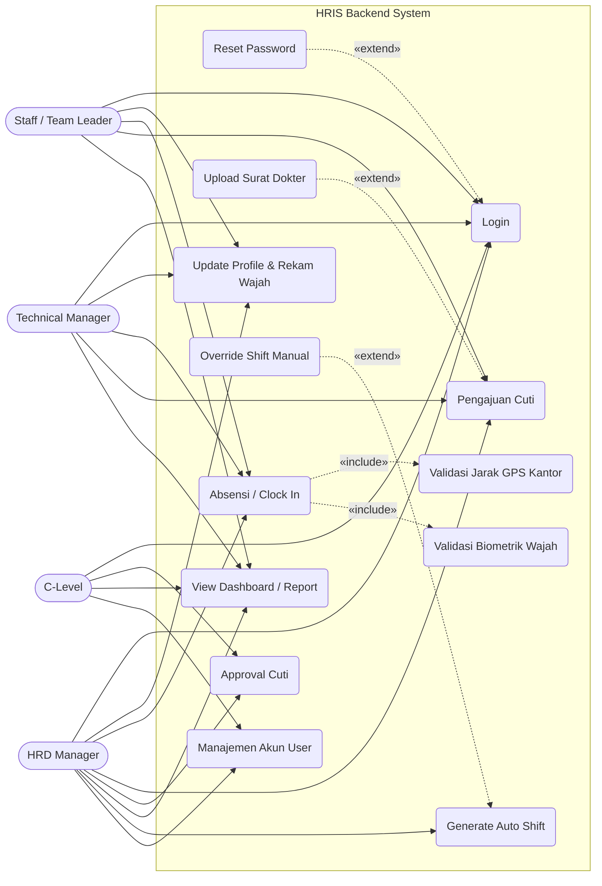
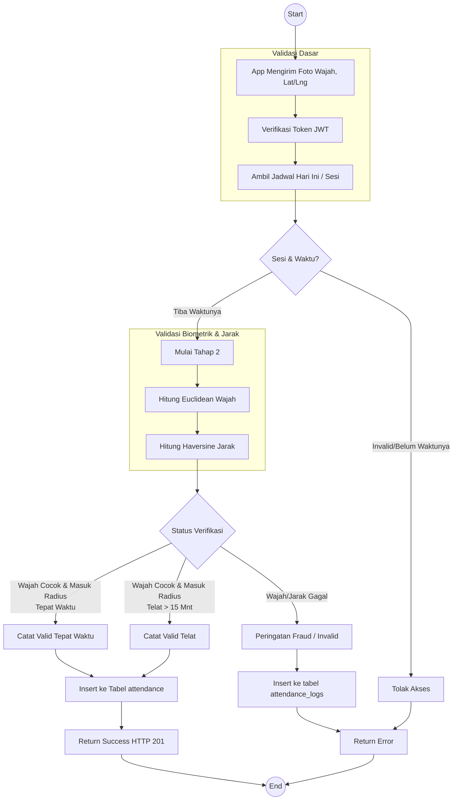
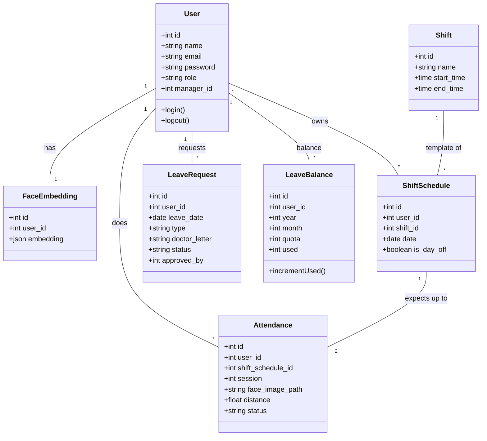
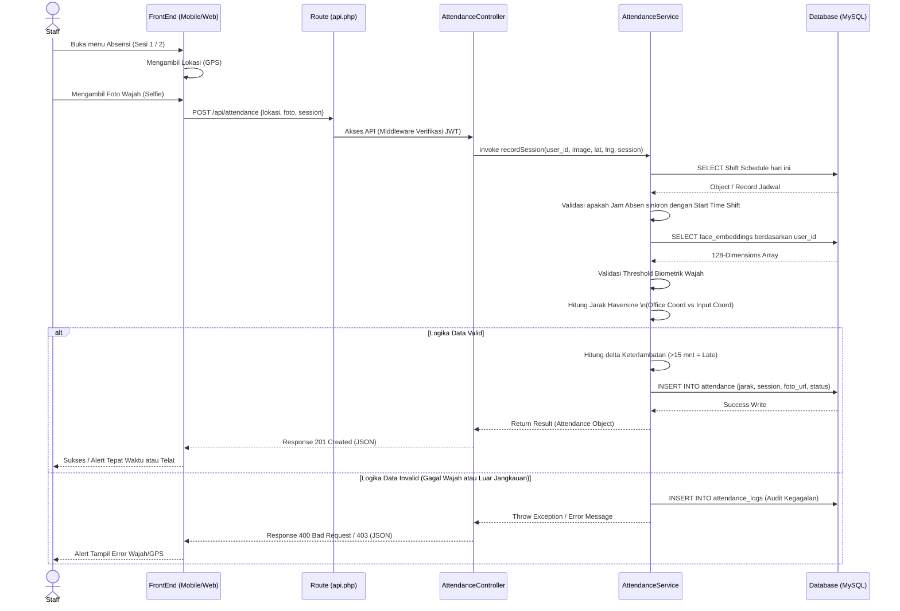

# UML Diagrams - HRIS Attendance System (Gaming House Edition)

Dokumen ini berisi sekumpulan diagram UML (Use Case, Activity, Class, dan Sequence) untuk sistem backend HRIS Gaming House berdasarkan alur kerja dan arsitektur `hris_architecture_v2.md`. Diagram dibuat menggunakan format `Mermaid`.

## 1. Use Case Diagram

Menggambarkan interaksi antara berbagai peran (Actor) dengan fitur-fitur fungsional sistem (Use Cases).

## 2. Activity Diagram (Alur Absensi)

Menggambarkan proses langkah demi langkah (flow) dari saat karyawan melakukan absensi sesi ke-1 atau ke-2 dengan validasi ganda.

## 3. Class Diagram

Struktur Class Entity Map yang merepresentasikan relasi tabel di dalam database system backend HRIS.

## 4. Sequence Diagram (Attendance Flow)

Alur sekuensial (komunikasi antar objek REST layer) sistem dari Frontend ke layer Database Backend saat mengirim data absensi.

